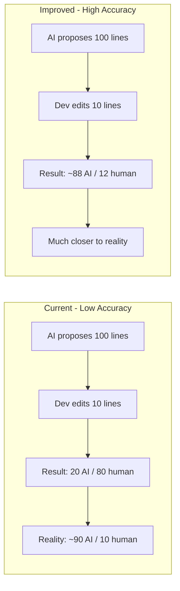

# Optimize AI Code Tracker Accuracy

## Current Problems

Three accuracy issues in the current implementation:

**Problem A: Only last proposal saved** -- `log_ai_output.ps1` overwrites `last_proposal.txt` each time. If the dev had 5 Copilot interactions before one commit, only the last proposal is compared. All code from earlier interactions is invisible.

**Problem B: Exact line match** -- `pre_commit.ps1` uses a HashSet for exact string comparison. If the dev changes even one character (rename variable, fix typo, reformat), the entire line counts as "human" even though the AI wrote 95% of it.

**Problem C: Trivial lines counted** -- Lines like `}`, `{`, `return;`, common imports always match the AI set because they're boilerplate. This inflates the AI count with lines the dev would have written anyway.




---

## Changes

### 1. Accumulate all proposals -- [scripts/log_ai_output.ps1](scripts/log_ai_output.ps1)

Instead of overwriting `last_proposal.txt`, **append** each proposal to a combined file with a separator:

- Write each proposal to `ai_buffer/proposals/{timestamp}.txt` (individual file per interaction)
- Also append all lines to `ai_buffer/all_proposals.txt` (combined, for fast lookup in pre-commit)
- On next commit cycle (post-commit), clean up both

This way if Copilot ran 5 times before a commit, all 5 proposals are available for comparison.

### 2. Normalized + fuzzy matching -- [scripts/pre_commit.ps1](scripts/pre_commit.ps1)

Replace the exact HashSet with a three-tier matching approach:

**Tier 1 - Normalized exact match:** Trim whitespace, collapse multiple spaces to one, then compare. Catches formatting-only changes (indent, trailing spaces).

**Tier 2 - Token similarity (Jaccard):** For lines that didn't match in tier 1, split both the staged line and each AI line into tokens (split on non-word characters). Calculate overlap ratio: `(common tokens) / (total unique tokens)`. If similarity >= 0.7 (70%), count as **ai_modified** -- a new category meaning "AI-originated but dev-edited."

**Tier 3 - Human:** Lines below the 0.7 threshold are counted as human.

Output categories become:

- `ai_lines` -- exact/normalized match, AI wrote this as-is
- `ai_modified_lines` -- AI-originated, dev made small changes
- `human_lines` -- dev wrote from scratch

### 3. Filter trivial lines -- [scripts/pre_commit.ps1](scripts/pre_commit.ps1)

Before comparison, exclude lines that match trivial patterns:

- Only brackets/braces: `{`, `}`, `});`, `]);`, etc.
- Only keywords: `else`, `break`, `continue`, `return`
- Very short lines (less than 4 non-whitespace characters)

These lines are excluded from **all** counts (AI, modified, and human) since they carry no signal. They will be tracked separately as `trivial_lines` for transparency.

### 4. Update metadata schema -- [scripts/post_commit.ps1](scripts/post_commit.ps1)

The Git Note JSON becomes:

```json
{
  "ai_lines": 45,
  "ai_modified_lines": 12,
  "human_lines": 8,
  "trivial_lines": 15,
  "total_added": 80,
  "ai_percentage": 71.3,
  "files_changed": ["src/app.js"],
  "proposals_count": 3
}
```

`ai_percentage` = `(ai_lines + ai_modified_lines) / (ai_lines + ai_modified_lines + human_lines) * 100`

Trivial lines are excluded from the percentage calculation.

### 5. Update CI report -- [.github/workflows/collect_ai_metrics.yml](.github/workflows/collect_ai_metrics.yml)

Add `ai_modified_lines` to the summary output and calculate overall percentage using the new formula.

### 6. Cleanup in post-commit -- [scripts/post_commit.ps1](scripts/post_commit.ps1)

Replace cleanup of single `last_proposal.txt` with cleanup of `ai_buffer/proposals/` directory and `all_proposals.txt`.

---

## Files Changed

- [scripts/log_ai_output.ps1](scripts/log_ai_output.ps1) -- accumulate proposals instead of overwrite
- [scripts/log_ai_output.sh](scripts/log_ai_output.sh) -- same changes, bash version
- [scripts/pre_commit.ps1](scripts/pre_commit.ps1) -- normalized + fuzzy matching + trivial filter
- [scripts/pre_commit.sh](scripts/pre_commit.sh) -- same changes, bash version
- [scripts/post_commit.ps1](scripts/post_commit.ps1) -- new metadata schema + cleanup
- [scripts/post_commit.sh](scripts/post_commit.sh) -- same changes, bash version
- [.github/workflows/collect_ai_metrics.yml](.github/workflows/collect_ai_metrics.yml) -- updated report format

